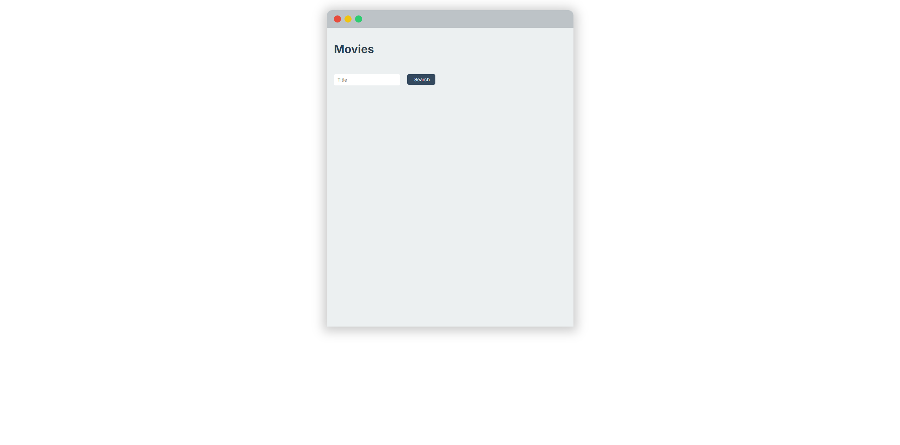
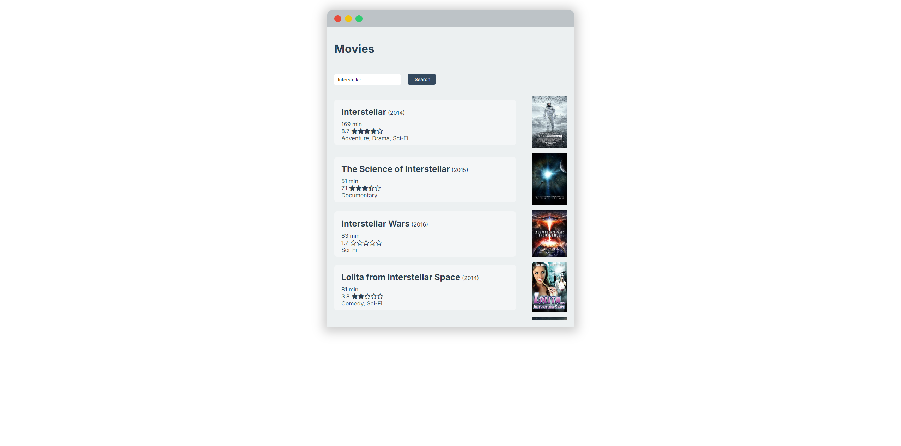
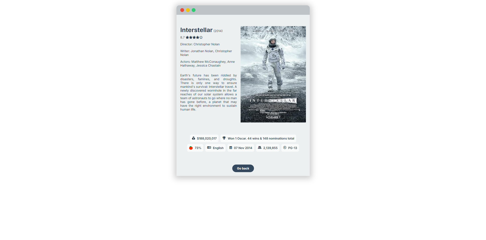

# Imdb clone

This projects is created using React.js and is one of my first React projects.

Initially i wanted to do a project involving API calls, which lead me to this rather simple project.

I really enjoyed working with React due to its structure around using 'components'. 

